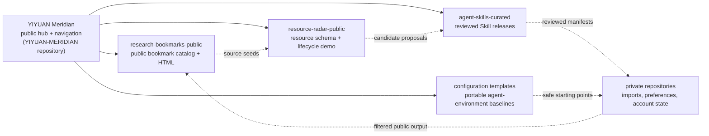

# YIYUAN-MERIDIAN

English | [简体中文](README.zh-CN.md)

> Repository: **YIYUAN-MERIDIAN**.
> Public project name: **YIYUAN Meridian**.
> Current GitHub URL: <https://github.com/yiheng8023/YIYUAN-MERIDIAN>.

YIYUAN Meridian is a public-safe starter system for turning scattered links, tools, agent skills,
bookmarks, and AI-collaboration configuration into something reusable without
publishing private state.

The short version: keep the complete working set private, publish only reviewed
public outputs, and let GitHub automation regenerate and verify the parts other
people can reuse.

## Start here

| If you want to... | Go here | What you get |
| --- | --- | --- |
| Import the public bookmark catalog | [`research-bookmarks-public`](https://github.com/yiheng8023/research-bookmarks-public) | 328 public-safe sources plus generated browser-importable HTML |
| Try the resource-radar pattern | [`resource-radar-public`](https://github.com/yiheng8023/resource-radar-public) | schema, scoring/lifecycle examples, demo records, and [`outputs/demo-report.md`](https://github.com/yiheng8023/resource-radar-public/blob/main/outputs/demo-report.md) |
| Build a private agent-environment repo | [`codex-user-config-template`](https://github.com/yiheng8023/codex-user-config-template) or [`claude-user-config-template`](https://github.com/yiheng8023/claude-user-config-template) | current public-safe examples of a broader migration, cloud sync/backup, verification, and restore pattern |
| Understand portable intent and routing | [`docs/intent-contract-portability.md`](docs/intent-contract-portability.md) | how continuous intent contracts and capability routing can adapt across agent runtimes |
| Understand the whole system | [`docs/system-topology.md`](docs/system-topology.md) and [`docs/repository-map.md`](docs/repository-map.md) | the repository map, boundaries, and relationship rules |
| Help improve the project | [`CONTRIBUTING.md`](CONTRIBUTING.md) and [`docs/user-developer-compact.md`](docs/user-developer-compact.md) | contribution scope, user rights, safety expectations, and feedback paths |

You can read and use the public outputs directly on GitHub. A local checkout is
only needed if you want to run the scripts yourself or submit changes.

## What is this?

This is not a bookmark dump, prompt pack, or private configuration backup. It
is a small governance pattern:

```text
private collection
-> structured records
-> public-safe output
-> generated output
-> validation
-> feedback
-> renewal
```

The first completed path is the bookmark path:

```text
389 private bookmark entries
-> filtered public-safe output
-> 328 public-safe sources
-> generated browser-importable HTML
-> verification and user-flow simulation
```

That proof lives in
[`research-bookmarks-public`](https://github.com/yiheng8023/research-bookmarks-public):

- [`data/public-sources.json`](https://github.com/yiheng8023/research-bookmarks-public/blob/main/data/public-sources.json)
  stores the structured public catalog.
- [`exports/research-engineering-bookmarks-public.html`](https://github.com/yiheng8023/research-bookmarks-public/blob/main/exports/research-engineering-bookmarks-public.html)
  is the generated browser-importable HTML.
- [`data/projection-report.json`](https://github.com/yiheng8023/research-bookmarks-public/blob/main/data/projection-report.json)
  records the public output counts and evidence.

## Repository navigation

The project is a set of connected workstreams, not one giant repository. Each
public repository explains its own role; this hub keeps the global map.

| Repository | Role | Visibility |
| --- | --- | --- |
| `YIYUAN-MERIDIAN` | YIYUAN Meridian public hub, navigation, shared rules, launch/readiness docs | public |
| `research-bookmarks-public` | public bookmark catalog and generated HTML | public |
| `resource-radar-public` | public resource-radar template and demo reports | public |
| `codex-user-config-template` | Codex-specific public example of the portable agent-environment template pattern | public |
| `claude-user-config-template` | Claude Code-specific public example of the portable agent-environment template pattern | public |
| `resource-radar`, `research-bookmarks`, user config repos | real imports, review pools, private state, memory, preferences, account state | private |
| `agent-skills-curated` | reviewed Skill governance and release evidence | public |

<details>
<summary>Topology snapshot</summary>



</details>

For edge meanings and the full graph, see
[`docs/system-topology.md`](docs/system-topology.md). If you enter through a
sub-repository, look for its "System context" section.

## Cloud-first renewal

The public workflow is GitHub-native:

- public repositories keep source data, generated outputs, policies, and
  validation scripts together;
- GitHub Actions runs checks on pull requests and pushes;
- generated outputs are committed as reviewable artifacts instead of hidden
  local files;
- private state remains private and is not needed to inspect public output.

The system is meant to renew itself over time:

```text
discover or import
-> normalize
-> score and classify
-> generate public-safe output
-> verify
-> review
-> publish
-> watch for stale links, duplicates, license drift, and better sources
-> renew, retire, merge, or reject
```

Automation prepares evidence and catches drift. Human review still controls
publication, visibility, funding, promotion, private state, and high-impact
acceptance decisions.

## What problem does this solve?

Useful resources usually decay in four ways:

1. They are scattered across browser bookmarks, GitHub stars, notes, chats, and
   local folders.
2. Private preferences, account state, local paths, and public references get
   mixed together.
3. "Good resource" decisions are hard to reproduce, review, or share.
4. Automation can collect more material than a human can safely judge.

This project provides a lightweight governance pattern for that problem:

```text
collect broadly
-> classify and score
-> keep private state private
-> publish only public-safe outputs
-> verify generated artifacts
-> review high-impact changes before release
```

## Who is this for?

- Developers and AI-tool users who want a portable resource system instead of a
  random pile of bookmarks and agent files.
- Maintainers who want to share public-safe rules, schemas, and examples while
  keeping personal configuration private.
- Researchers, builders, and small teams who want automation to help discover
  useful resources without turning into an unreviewed content dump.
- Future contributors who want to improve the taxonomy, validation, resource
  discovery, bookmark projection, or curated-skill governance lanes.

## What can you use today?

This repository is the public hub. It explains the system and verifies the
public-safe governance layer.

Current usable pieces:

- A public-safe system map for related repositories and lanes.
- A public/private boundary model for keeping personal data out of public
  artifacts.
- Public configuration templates for portable AI-collaboration setup:
  [`codex-user-config-template`](https://github.com/yiheng8023/codex-user-config-template)
  and [`claude-user-config-template`](https://github.com/yiheng8023/claude-user-config-template).
- A public-safe resource-radar template:
  [`resource-radar-public`](https://github.com/yiheng8023/resource-radar-public),
  with schema, demo resources, scoring/lifecycle policy examples, generated
  reports, and validation.
- A launch and contribution scaffold: license, conduct, support, security,
  feedback templates, and verification.
- Public launch assets and copy for explaining the project.
- A companion public bookmark projection in
  [`research-bookmarks-public`](https://github.com/yiheng8023/research-bookmarks-public),
  including structured public sources, an aggregate projection report, and
  generated browser-importable HTML.

Some lanes are intentionally private until they are ready to be released or
generalized. Private lanes may contain personal imports, review evidence, local
state, or pre-public automation work.

## Current MVP status

The current MVP is the curated Skills terminal-consumer loop. The first small
batch has now passed the release/routing/install/lifecycle/global-closeout path
for this MVP scope. The next state is pause and observe before another gated
batch, terminal consumer, or broad public-promotion refresh.

Current evidence:

- MVP-01 source candidate selection: passed.
- MVP-02 review, neutralization, and non-runtime adapted draft creation: passed.
- MVP-03 release/routing follow-up execution: passed for the selected small
  batch after explicit owner approval.
- Private consumer install and routing verification: passed for
  `agent-skills-curated` release `e80d497...` consumed by
  `codex-user-config` at `a89b617...`.
- MVP-06 lifecycle feedback and radar dedupe metadata: passed in
  `agent-skills-curated` at `74c8c17...`.
- Public release posture update: `agent-skills-curated` is public at
  `73ce81b...` with public-safe README, security, and community boundaries.
- MVP-07 selected-MVP global closeout: passed; this is not a universal
  completion claim.

This means the selected batch is no longer merely candidate evidence:
`spec-driven-development` became a recipe/routing projection, while
`documentation-and-adrs` and `code-review-and-quality` were merged into
existing approved Skills. The release manifest remains schema 1 with 19 curated
Skills and 41 files; only the approved `grill-with-docs` and `review` payload
files changed.

This does not approve broad new source discovery, official/runtime Skill
vendoring, public promotion, video launch claims, or unrelated private-runtime
changes.

The current decision point is recorded in
[`docs/mvp-current-decision-point.md`](docs/mvp-current-decision-point.md).
The evidence ledger is
[`docs/mvp-closeout-evidence-ledger.md`](docs/mvp-closeout-evidence-ledger.md).
The executed release/routing proof is
[`docs/mvp03-release-routing-closeout-2026-06-27.md`](docs/mvp03-release-routing-closeout-2026-06-27.md).

## What can you reuse?

You can use this project as a reference implementation for:

| Goal | What this system gives you |
| --- | --- |
| Publish useful resources without leaking private state | Public/private boundary rules and validation checks |
| Turn browser bookmarks into a maintainable catalog | Structured source records plus generated importable HTML |
| Keep broad resource discovery from becoming noise | A public resource-radar template plus a private radar lane for scoring, lifecycle, deduplication, and human gates |
| Share AI/agent skills across environments safely | A curated-skills lane with provenance, safety review, topology, conflict handling, and release manifests |
| Make AI collaboration portable | Agent-environment template lanes that separate reusable structure from private preferences; Codex and Claude are the current examples |
| Preserve intent and capability boundaries across agents | A portable intent-contract adapter matrix that treats Codex as the first validated implementation, not the only implementation |
| Let other people improve the system | Contribution, issue, security, conduct, naming, and launch docs |

The important idea is not any single script. The value is the closed loop:

```text
collect -> structure -> filter -> generate -> verify -> review -> publish -> renew
```

That loop is what makes the work reusable instead of just being one person's
private pile of links and notes.

## How the system works

The design is modular. This hub does not try to become one giant repository.
Each lane has a narrower responsibility:

```text
YIYUAN-MERIDIAN / YIYUAN Meridian
  public hub, docs, repository map, launch materials, shared safety rules

resource-radar
  private discovery source, normalization, scoring, deduplication, lifecycle reports

resource-radar-public
  public-safe resource radar schema, demo fixtures, scoring/lifecycle examples, reports, validation

research-bookmarks
  private complete bookmark source, overlays, audits, declassification inputs

research-bookmarks-public
  public-safe bookmark catalog and generated browser-importable HTML

agent-skills-curated
  reviewed third-party Skill content, provenance, topology, conflicts, releases

codex-user-config-template
  Codex-specific public implementation of the broader agent-environment template pattern

codex-user-config
  private Codex environment source and memory carrier

claude-user-config-template
  Claude Code-specific public implementation of the broader agent-environment template pattern

claude-user-config
  private Claude Code environment source, memory, commands, and hooks
```

The core rule is:

```text
public core + private state
```

Public repositories should contain reusable structure, rules, schemas,
documentation, examples, official/public-safe references, and generated
artifacts that have passed checks. Private repositories can keep personal
bookmarks, configuration, memory, preferences, account state, local paths, and
work-in-progress decisions.

The user-configuration lane is generic in purpose but runtime-specific in
implementation. Its purpose is agent-environment migration, cloud sync/backup,
restore, verification, rollback, and runtime integration. Concrete templates
can be Codex-specific, Claude-specific, or future-agent-specific because real
agents store different files, memory, hooks, tools, MCPs, plugins, permissions,
and account state. Other lanes should stay agent-neutral, tool-neutral, and
generically reusable.

## Quick start

Clone the hub and run the verification check:

```bash
git clone https://github.com/yiheng8023/YIYUAN-MERIDIAN.git
cd YIYUAN-MERIDIAN
python -B scripts/verify.py
```

Then read these in order:

1. [`docs/repository-map.md`](docs/repository-map.md) — what each repository
   owns.
2. [`docs/system-topology.md`](docs/system-topology.md) — the global graph,
   topology, and public/private relationships.
3. [`docs/public-private-boundary.md`](docs/public-private-boundary.md) — what
   can and cannot be public.
4. [`docs/roadmap.md`](docs/roadmap.md) — what is planned next.
5. [`docs/naming-campaign.md`](docs/naming-campaign.md) — how naming, wording,
   translation, and discoverability refinements are reviewed.

If you only want the bookmark output, start with
[`research-bookmarks-public`](https://github.com/yiheng8023/research-bookmarks-public).

## Example user journeys

### I just want useful links

Open [`research-bookmarks-public`](https://github.com/yiheng8023/research-bookmarks-public),
review the public catalog, and import the generated HTML into your browser if
it matches your needs.

### I want to build my own public/private bookmark system

Use the bookmark lane as a model:

1. keep your complete browser export private;
2. convert selected sources into structured public-safe records;
3. generate a browser-importable public HTML file;
4. run validation before publishing;
5. keep personal preferences and local-only entries private.

### I want to help improve the project

Start with small, reviewable changes:

- improve a taxonomy label;
- suggest a better project name or naming refinement;
- add a safer validation check;
- propose a public-safe resource category;
- clarify the docs for first-time users.

### I want to sponsor or support it

The useful public work is currently docs, taxonomy, validation, generated
artifacts, and examples. Support helps turn private experiments into reusable,
public-safe templates and automation that other people can actually run.

## Design principles

1. Public-safe by default: do not publish private configuration, private
   bookmarks, memory, credentials, local paths, account state, or personal
   preference data.
2. Modular lanes over one giant system: each repository owns a clear part of
   the workflow.
3. Automation with gates: generated artifacts should be deterministic and
   verified; high-impact promotion still requires human review.
4. Useful, not maximal: the goal is better coverage, discovery, and judgment,
   not collecting everything.
5. Evidence over vibes: important claims should have scripts, reports, or
   review records behind them.
6. Candidate lanes stay lightweight: future directions should be tracked as
   candidate lanes first, not built into systems before there is evidence,
   maintenance capacity, and real user value.
7. Shared baseline, differentiated lanes: repositories should reuse the same
   governance logic where possible while preserving lane-specific content,
   authority, and verification.

## What this repository does not do

This hub does not:

- store private user configuration or native memory;
- import a full private bookmark archive;
- release curated Skill payloads;
- install or configure runtime tools;
- prove that every related private lane is ready for public release;
- replace project-specific review, licensing review, or security review.

## Contributing

Good first contributions include:

- clearer wording for external users;
- taxonomy and repository-map improvements;
- safer public/private boundary examples;
- naming, subtitle, translation, or wording refinements under an owner-controlled gate;
- validation checks that prevent accidental private data exposure;
- feedback on the bookmark and resource-discovery lanes.

See [`CONTRIBUTING.md`](CONTRIBUTING.md),
[`CODE_OF_CONDUCT.md`](CODE_OF_CONDUCT.md), and
[`SECURITY.md`](SECURITY.md). The user/developer compact is recorded in
[`docs/user-developer-compact.md`](docs/user-developer-compact.md).

## Sustainability

The project is currently maintained as an independent public-good experiment.
If it helps you, the most useful support right now is:

- star the repository;
- share a concrete use case;
- open a focused issue;
- suggest a better name;
- contribute docs, taxonomy, validation, or examples.

See [`docs/support-and-sponsorship.md`](docs/support-and-sponsorship.md) for the
current support entry, sponsorship-interest contact path, and future funding
activation gate. Formal payment channels will be listed only after they are
owner-controlled and verified.

Funding-channel tradeoffs are tracked in
[`docs/funding-options-matrix.md`](docs/funding-options-matrix.md), including
international, fiscal-host, and domestic-support considerations.

## Documentation index

- [`docs/project-design.md`](docs/project-design.md) — external-user design
  rationale, value loops, user journeys, and contribution surface.
- [`docs/user-developer-compact.md`](docs/user-developer-compact.md) — user
  sovereignty, developer expectations, participation value, and limits.
- [`docs/public-project-positioning-benchmark.md`](docs/public-project-positioning-benchmark.md)
  — public README and sustainability positioning benchmark.
- [`docs/repository-map.md`](docs/repository-map.md) — repository roles and
  relationships.
- [`docs/system-topology.md`](docs/system-topology.md) — global graph,
  topology, and repository relationship index.
- [`docs/public-private-boundary.md`](docs/public-private-boundary.md) —
  public/private safety boundary.
- [`docs/shared-governance-baseline.md`](docs/shared-governance-baseline.md) —
  common governance expectations shared across the repository family.
- [`docs/intent-contract-portability.md`](docs/intent-contract-portability.md)
  — portable continuous intent-contract invariants and agent adapter matrix.
- [`docs/mvp-plan-and-acceptance.md`](docs/mvp-plan-and-acceptance.md) — curated
  Skills terminal-consumer MVP plan and acceptance criteria.
- [`docs/mvp-global-closeout-verification.md`](docs/mvp-global-closeout-verification.md)
  — cross-repository MVP closeout and public-refresh checklist.
- [`docs/mvp-closeout-evidence-ledger.md`](docs/mvp-closeout-evidence-ledger.md)
  — selected-MVP evidence snapshot and closeout status; explicitly not a
  universal completion claim.
- [`docs/mvp-current-decision-point.md`](docs/mvp-current-decision-point.md)
  — current MVP state; records pause-and-observe after selected-MVP closeout
  and the future gates that still require explicit approval.
- [`docs/mvp-artifact-hygiene-review.md`](docs/mvp-artifact-hygiene-review.md)
  — Gate 08 process-artifact hygiene review; explicitly keeps drafts,
  generated outputs, and promotion material from becoming accidental truth.
- [`docs/mvp-continuous-assurance-review.md`](docs/mvp-continuous-assurance-review.md)
  — Gate 09 continuous-assurance review; treats green checks as snapshot
  evidence, not permanent health certificates.
- [`docs/mvp-persistence-continuity-review.md`](docs/mvp-persistence-continuity-review.md)
  — Gate 10 persistence and continuity review; records recovery anchors for
  context loss, environment changes, agent switches, and interrupted work.
- [`docs/mvp-observability-explainability-review.md`](docs/mvp-observability-explainability-review.md)
  — Gate 11 observability and explainability review; records the evidence
  contract for automation, routing, cleanup, lifecycle, release, and public
  claims.
- [`docs/public-launch-gates.md`](docs/public-launch-gates.md) — gates before
  public release.
- [`docs/free-promotion-playbook.md`](docs/free-promotion-playbook.md) —
  free-channel launch and promotion planning runbook; publication remains gated.
- [`docs/launch-video-brief.md`](docs/launch-video-brief.md) — short launch
  video script, storyboard, and AI video prompt draft; publication remains gated.
- [`docs/launch-video-assets.md`](docs/launch-video-assets.md) — prepared
  public-safe launch image assets; publication remains gated.
- [`docs/bookmark-lane-closeout-2026-06-26.md`](docs/bookmark-lane-closeout-2026-06-26.md)
  — bookmark lane split, verification, and public/private closeout evidence.
- [`docs/support-and-sponsorship.md`](docs/support-and-sponsorship.md) —
  support entry, sponsorship-interest contact path, and funding activation
  gate.
- [`docs/funding-options-matrix.md`](docs/funding-options-matrix.md) — funding
  channel evaluation matrix and activation checklist.
- [`docs/future-lane-incubation.md`](docs/future-lane-incubation.md) —
  candidate future lanes and graduation rules.
- [`docs/private-project-consumption-model.md`](docs/private-project-consumption-model.md)
  — how public-safe outputs can support private/core projects without exposing
  or mutating them.
- [`docs/contact-and-social.md`](docs/contact-and-social.md) — public-safe
  contact routes and future social-link policy.

## Safety boundary

This repository is public. Every update must remain public-safe. Do not add
private configuration, private bookmarks, memory, credentials, local paths,
account state, personal preference data, browser/session data, or third-party
restricted content.
