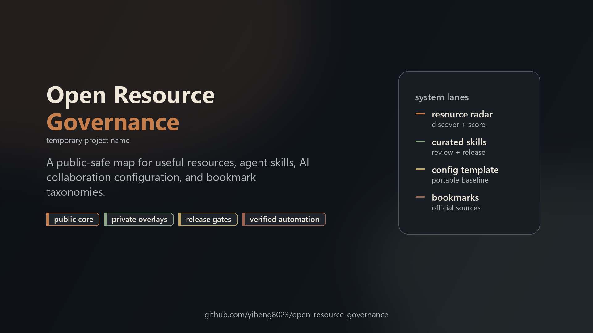

# open-resource-governance

[English](README.md) | 简体中文

> `open-resource-governance` 只是临时项目名和暂定仓库 slug。
> 未来可能根据公开征名反馈变更。



这是一个公开安全的起步系统，用来组织有价值的资源、研究书签、AI /
Agent skills、可迁移 AI 协作配置，同时避免把私有状态泄露到公开仓库。

如果你也把链接、工具、提示词、agent skills、模板、自动化想法分散放在
浏览器书签、GitHub stars、笔记、聊天记录和本地文件夹里，这个项目要解决
的就是：把这些东西变成可治理、可复现、可公开协作、又不泄露隐私的系统。

## 一分钟看懂

这不是书签 dump、提示词包，也不是私人配置备份。它是一套用来搭建小型
资源治理生态的模式：

```text
私有收集
-> 结构化记录
-> 公开安全投影
-> 确定性生成
-> 验证
-> 社区反馈
-> 周期性更新
```

第一条已经跑通的 lane 是书签：

- 私有来源仓保存完整浏览器导入；
- 公开仓发布经过过滤的结构化目录和可导入浏览器 HTML；
- 验证脚本检查公开产物不会误带私有数据；
- 同样的模式后续可以服务资源发现、curated skills 和可迁移 AI 协作配置。

## 不是只画饼，已有跑通证据

截至 2026-06-26，第一条 lane 已经端到端跑通：

```text
389 条私有书签记录
-> 过滤成公开安全投影
-> 328 条公开安全来源
-> 生成可导入浏览器 HTML
-> 验证和用户流程模拟
```

公开产物在
[`research-bookmarks-public`](https://github.com/yiheng8023/research-bookmarks-public)：

- 结构化来源目录：
  [`data/public-sources.json`](https://github.com/yiheng8023/research-bookmarks-public/blob/main/data/public-sources.json)
- 生成的可导入浏览器 HTML：
  [`exports/research-engineering-bookmarks-public.html`](https://github.com/yiheng8023/research-bookmarks-public/blob/main/exports/research-engineering-bookmarks-public.html)

这很关键：项目不是让用户相信一张架构图，而是已经展示了一个有生成产物、
有公开/私有拆分、有验证检查的工作闭环。

## 它解决什么问题？

有价值的资源通常会这样失控：

1. 散落在浏览器书签、GitHub stars、笔记、聊天记录和本地目录里。
2. 私人偏好、账号状态、本机路径和公开参考资料混在一起。
3. “为什么这个资源值得收录”缺少可复查、可复现、可共享的依据。
4. 自动化可以搜到很多东西，但人类不可能安全地逐条判断所有内容。

本项目提供的是一套轻量治理模式：

```text
广泛收集
-> 分类和评分
-> 私有 overlay 留在私有仓
-> 只发布公开安全投影
-> 验证生成产物
-> 高影响变更经过人工闸门
```

## 适合谁？

- 希望把资源、书签、AI/Agent 工具链整理成可迁移系统的开发者和 AI 工具用户。
- 想公开共享规则、schema、示例，但不想暴露个人配置的维护者。
- 希望用自动化发现优质资源，但又不想把仓库变成无审查内容堆的研究者、构建者和小团队。
- 想参与改进分类、验证、资源发现、书签投影、curated skills 治理链路的贡献者。

## 现在能用什么？

本仓库是公开总入口，负责解释体系并验证公开安全治理层。

当前已经可用的部分：

- 关联仓库和 lane 的公开安全体系地图。
- 用于防止个人数据进入公开产物的公开/私有边界模型。
- 可迁移 AI 协作配置的公开模板：
  [`codex-user-config-template`](https://github.com/yiheng8023/codex-user-config-template)
  和 [`claude-user-config-template`](https://github.com/yiheng8023/claude-user-config-template)。
- 公开安全资源雷达模板：
  [`resource-radar-public`](https://github.com/yiheng8023/resource-radar-public)，
  包含 schema、demo 资源、评分/生命周期策略示例、生成报告和验证。
- 开源项目的基础脚手架：许可证、行为准则、支持、安全、反馈模板和验证。
- 用来解释项目的公开发布素材和文案。
- 配套公开书签投影仓
  [`research-bookmarks-public`](https://github.com/yiheng8023/research-bookmarks-public)，
  包含结构化公开来源、聚合投影报告和生成的可导入浏览器 HTML。

有些 lane 暂时保持私有，是因为它们还包含个人导入、审查证据、本地状态或公开前自动化工作。

## 你能复刻什么价值？

你可以把这个项目当成以下能力的参考实现：

| 目标 | 这套系统提供什么 |
| --- | --- |
| 发布有用资源但不泄露私有状态 | 公开/私有边界规则和验证检查 |
| 把浏览器书签变成可维护目录 | 结构化来源记录 + 生成的可导入 HTML |
| 避免广义资源发现变成噪音 | 公开 resource-radar 模板 + 私有 radar lane：评分、生命周期、去重、人工闸门 |
| 在不同环境安全共享 AI/Agent skills | curated skills lane：来源、安全审查、拓扑、冲突、发布清单 |
| 让 AI 协作配置可迁移 | Codex 与 Claude 配置模板 lane：把可复用结构和私人偏好分开 |
| 让别人参与共建 | 贡献、issue、安全、行为准则、命名和发布文档 |

关键不在某个单独脚本，而在这个闭环：

```text
收集 -> 结构化 -> 过滤 -> 生成 -> 验证 -> 审查 -> 发布 -> 更新
```

正是这个闭环，让它不是某个人私人的链接和笔记堆，而是别人也能复用、扩展和审查的系统。

## 它如何工作？

设计上采用模块化，而不是把所有东西塞进一个巨型仓库。每条 lane 只负责一件相对清晰的事：

```text
open-resource-governance
  公开总入口、文档、仓库地图、发布素材、共享安全规则

resource-radar
  私有发现来源、归一化、评分、去重、生命周期报告

resource-radar-public
  公开安全资源雷达 schema、demo fixtures、评分/生命周期示例、报告和验证

research-bookmarks
  私有完整书签来源、overlay、审计、脱敏输入

research-bookmarks-public
  公开安全书签目录和生成的可导入浏览器 HTML

agent-skills-curated
  已审查第三方 Skill 正文、来源、拓扑、冲突和发布清单

codex-user-config-template
  公开安全 Codex 配置模板

codex-user-config
  私有 Codex 配置真源与记忆载体

claude-user-config-template
  公开安全 Claude Code 配置模板

claude-user-config
  私有 Claude Code 配置真源、记忆、commands 与 hooks
```

核心规则是：

```text
公开核心 + 私有 overlay
```

公开仓承载可复用结构、规则、schema、文档、示例、官方/公开安全来源，以及通过验证的生成产物。
私有仓保留个人书签、配置、记忆、偏好、账号状态、本机路径和未公开决策。

例外是用户配置 lane：配置仓可以明确区分 Codex 或 Claude，因为它们对应真实的私有用户环境。
其它 lane 应保持 Agent 中立、工具中立、通用和可复用。

## 快速开始

克隆总入口仓并运行验证：

```bash
git clone https://github.com/yiheng8023/open-resource-governance.git
cd open-resource-governance
python -B scripts/verify.py
```

然后按这个顺序看：

1. [`docs/repository-map.md`](docs/repository-map.md) — 每个仓库负责什么。
2. [`docs/system-topology.md`](docs/system-topology.md) — 全局图、拓扑和公开/私有关系。
3. [`docs/public-private-boundary.md`](docs/public-private-boundary.md) — 什么可以公开，什么不能公开。
4. [`docs/roadmap.md`](docs/roadmap.md) — 后续计划。
5. [`docs/naming-campaign.md`](docs/naming-campaign.md) — 临时名称未来如何征集和调整。

如果你只关心书签产物，可以直接看
[`research-bookmarks-public`](https://github.com/yiheng8023/research-bookmarks-public)。

## 示例用户路径

### 我只想找有用链接

打开 [`research-bookmarks-public`](https://github.com/yiheng8023/research-bookmarks-public)，
查看公开目录。如果符合你的需要，可以把生成的 HTML 导入浏览器。

### 我想搭自己的公开/私有书签系统

参考书签 lane：

1. 完整浏览器导出留在私有仓；
2. 把适合公开的来源转成结构化记录；
3. 生成可导入浏览器的公开 HTML；
4. 发布前运行验证；
5. 个人偏好和本地专用入口继续留在私有层。

### 我想参与共建

先从小而清晰的改动开始：

- 改进一个分类名称；
- 给临时项目名提建议；
- 增加一个更安全的验证检查；
- 建议一个公开安全资源类别；
- 帮第一次来的用户把文档写得更清楚。

### 我想赞助或支持

目前最有公共价值的工作是文档、分类、验证、生成产物和示例。支持这个项目，
等于帮助把私人实验转化成别人也能运行、复用、审查的公开安全模板和自动化。

## 设计依据

1. 默认公开安全：不要发布私有配置、私有书签、记忆、凭据、本机路径、账号状态或个人偏好。
2. 模块化 lane，而不是巨型一体化系统：每个仓库只拥有清晰的一段链路。
3. 自动化要有闸门：生成产物应确定、可验证；高影响公开仍需人工审查。
4. 追求有用，不追求吞噬一切：目标是提高覆盖、发现和判断质量，不是收集所有东西。
5. 证据优先：重要结论应有脚本、报告或审查记录支撑。
6. 候选 lane 先保持轻量：未来方向应先作为 candidate lane 跟踪，不要在缺少证据、
   维护能力和真实用户价值之前做成系统。
7. 共享底座，差异化 lane：各仓库应尽量复用同一套治理逻辑，但保留各自内容、
   权威边界和验证方式。

## 本仓库不做什么

本总入口仓不负责：

- 保存私有用户配置或原生记忆；
- 导入完整私有浏览器书签；
- 发布 curated Skill payload；
- 安装或配置运行时工具；
- 证明所有关联私有 lane 都已经可以公开；
- 替代具体项目的许可证、安全或质量审查。

## 如何贡献？

适合优先贡献的内容包括：

- 让外部用户更容易看懂的表达；
- 分类和仓库地图改进；
- 更安全的公开/私有边界示例；
- 针对临时项目名的命名建议；
- 防止误泄露私有数据的验证检查；
- 对书签和资源发现 lane 的真实使用反馈。

请参考 [`CONTRIBUTING.md`](CONTRIBUTING.md)、
[`CODE_OF_CONDUCT.md`](CODE_OF_CONDUCT.md) 和 [`SECURITY.md`](SECURITY.md)。

## 可持续性

这个项目目前是一个独立维护的 public-good 实验。如果它对你有帮助，现在最有价值的支持是：

- star 仓库；
- 分享具体使用场景；
- 提一个聚焦 issue；
- 建议一个更好的名字；
- 贡献文档、分类、验证或示例。

见 [`docs/support-and-sponsorship.md`](docs/support-and-sponsorship.md)，其中记录了
当前支持入口、赞助意向联系路径和未来正式收款渠道的启用闸门。正式付款渠道只会在
owner 可控且验证通过后加入。

收款渠道取舍记录在 [`docs/funding-options-matrix.md`](docs/funding-options-matrix.md)，
其中包含国际渠道、fiscal host 和国内支持方式的评估边界。

## 文档索引

- [`docs/project-design.md`](docs/project-design.md) — 面向外部用户的设计依据、价值闭环、用户路径和共建入口。
- [`docs/public-project-positioning-benchmark.md`](docs/public-project-positioning-benchmark.md)
  — 公开 README 与可持续性表达的外部对标依据。
- [`docs/repository-map.md`](docs/repository-map.md) — 仓库角色与关系。
- [`docs/system-topology.md`](docs/system-topology.md) — 全局图、拓扑和仓库关系索引。
- [`docs/public-private-boundary.md`](docs/public-private-boundary.md) — 公开/私有安全边界。
- [`docs/shared-governance-baseline.md`](docs/shared-governance-baseline.md) — 仓库家族共享的治理底座。
- [`docs/mvp-plan-and-acceptance.md`](docs/mvp-plan-and-acceptance.md) — curated
  Skills 末端消费者 MVP 计划与验收标准。
- [`docs/mvp-global-closeout-verification.md`](docs/mvp-global-closeout-verification.md)
  — MVP 跨仓收官验收与公开文档/宣传刷新检查表。
- [`docs/mvp-closeout-evidence-ledger.md`](docs/mvp-closeout-evidence-ledger.md)
  — 当前 MVP 证据快照；明确不是完成声明。
- [`docs/mvp-artifact-hygiene-review.md`](docs/mvp-artifact-hygiene-review.md)
  — Gate 08 过程产物卫生审查；防止草稿、生成产物和宣传材料意外变成真相源。
- [`docs/mvp-continuous-assurance-review.md`](docs/mvp-continuous-assurance-review.md)
  — Gate 09 持续保障审查；把绿色检查视为当前快照证据，而不是永久健康证书。
- [`docs/mvp-persistence-continuity-review.md`](docs/mvp-persistence-continuity-review.md)
  — Gate 10 持久化与连续性审查；记录上下文丢失、环境变化、Agent 切换和中断恢复锚点。
- [`docs/public-launch-gates.md`](docs/public-launch-gates.md) — 公开发布前闸门。
- [`docs/free-promotion-playbook.md`](docs/free-promotion-playbook.md) — 免费渠道发布和推广 runbook。
- [`docs/launch-video-brief.md`](docs/launch-video-brief.md) — 首发短视频脚本、分镜和 AI 视频提示词。
- [`docs/launch-video-assets.md`](docs/launch-video-assets.md) — 公开安全首发图片素材。
- [`docs/bookmark-lane-closeout-2026-06-26.md`](docs/bookmark-lane-closeout-2026-06-26.md)
  — 书签 lane 拆分、验证和公开/私有收官证据。
- [`docs/support-and-sponsorship.md`](docs/support-and-sponsorship.md) — 支持入口、
  赞助意向联系路径和资金渠道启用闸门。
- [`docs/funding-options-matrix.md`](docs/funding-options-matrix.md) — 收款渠道
  评估矩阵与启用检查表。
- [`docs/future-lane-incubation.md`](docs/future-lane-incubation.md) — 候选未来
  lane 与晋级规则。
- [`docs/private-project-consumption-model.md`](docs/private-project-consumption-model.md)
  — 公开安全产物如何服务私有/核心项目，同时不暴露、不直接改写它们。
- [`docs/contact-and-social.md`](docs/contact-and-social.md) — 公开安全联系路径与未来社媒链接策略。

## 安全边界

本仓库是公开仓。后续每次更新都必须继续保持公开安全：不得加入私有配置、私有书签、记忆、凭据、
本机路径、账号状态、个人偏好、浏览器/session 数据或第三方受限内容。
