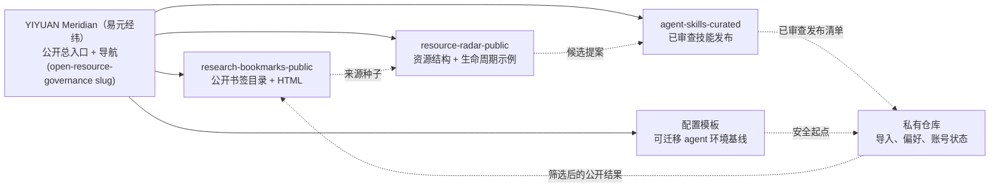

# YIYUAN Meridian（易元经纬）

[English](README.md) | 简体中文

> 当前项目名：**YIYUAN Meridian（易元经纬）**。
> 当前 GitHub 仓库 slug：`open-resource-governance`。
> 仓库 slug 未来可在完成链接、搜索和迁移检查后再决定是否调整。

YIYUAN Meridian（易元经纬）是一个公开安全的起步系统，用来把分散的链接、工具、Agent 技能、书签和
AI 协作配置整理成可复用的公共产物，同时把个人记忆、账号状态、本机路径和
私人偏好留在私有仓库里。

一句话：完整工作集留在私有层，公开仓只发布经过筛选、生成和验证的公共结果。
普通用户可以直接在 GitHub 上查看这些结果，不需要先搭建本地环境。

## 从这里开始

| 你想做什么 | 入口 | 能看到什么 |
| --- | --- | --- |
| 直接使用公开书签目录 | [`research-bookmarks-public`](https://github.com/yiheng8023/research-bookmarks-public) | 328 条公开安全来源，以及可导入浏览器的 HTML |
| 了解资源雷达怎么做 | [`resource-radar-public`](https://github.com/yiheng8023/resource-radar-public) | 资源记录结构、评分/生命周期示例、demo 数据和 [`outputs/demo-report.md`](https://github.com/yiheng8023/resource-radar-public/blob/main/outputs/demo-report.md) |
| 搭建自己的私有 agent 环境仓 | [`codex-user-config-template`](https://github.com/yiheng8023/codex-user-config-template) 或 [`claude-user-config-template`](https://github.com/yiheng8023/claude-user-config-template) | 当前两个公开安全示例，展示更通用的迁移、云端同步/备份、验证和恢复模式 |
| 理解可迁移的意图与路由链路 | [`docs/intent-contract-portability.md`](docs/intent-contract-portability.md) | 持续意图契约和能力路由如何适配不同 Agent 运行时 |
| 理解整套仓库关系 | [`docs/system-topology.md`](docs/system-topology.md) 和 [`docs/repository-map.md`](docs/repository-map.md) | 仓库地图、公开/私有边界和关系规则 |
| 参与共建 | [`CONTRIBUTING.md`](CONTRIBUTING.md) 和 [`docs/user-developer-compact.md`](docs/user-developer-compact.md) | 贡献范围、用户权益、安全要求和反馈方式 |

## 这是什么？

这不是书签导出、提示词合集，也不是私人配置备份。它更像一套轻量的治理流程：

```text
私有收集
-> 结构化记录
-> 公开安全结果
-> 生成产物
-> 验证
-> 反馈
-> 更新
```

第一条已经跑通的是书签链路：

```text
389 条私有书签记录
-> 筛选成公开安全结果
-> 328 条公开安全来源
-> 生成可导入浏览器的 HTML
-> 验证和用户流程模拟
```

对应的公开产物在
[`research-bookmarks-public`](https://github.com/yiheng8023/research-bookmarks-public)：

- [`data/public-sources.json`](https://github.com/yiheng8023/research-bookmarks-public/blob/main/data/public-sources.json)
  是结构化来源目录。
- [`exports/research-engineering-bookmarks-public.html`](https://github.com/yiheng8023/research-bookmarks-public/blob/main/exports/research-engineering-bookmarks-public.html)
  是生成后的浏览器书签 HTML。
- [`data/projection-report.json`](https://github.com/yiheng8023/research-bookmarks-public/blob/main/data/projection-report.json)
  记录公开结果的数量和证据。

## 仓库导航

这个项目由多条相互连接的链路组成，不是一个巨型单仓。每个公开仓库都应该
能说明自己的作用；本仓库负责保存全局地图。

| 仓库 | 作用 | 可见性 |
| --- | --- | --- |
| `open-resource-governance` | YIYUAN Meridian（易元经纬）公开总入口、导航、共享规则、发布准备文档 | 公开 |
| `research-bookmarks-public` | 公开书签目录和生成 HTML | 公开 |
| `resource-radar-public` | 资源雷达模板和示例报告 | 公开 |
| `codex-user-config-template` | 可迁移 agent 环境模板模式的 Codex 专用公开示例 | 公开 |
| `claude-user-config-template` | 可迁移 agent 环境模板模式的 Claude Code 专用公开示例 | 公开 |
| `resource-radar`、`research-bookmarks`、用户配置仓 | 真实导入、审查池、私有层、记忆、偏好、账号状态 | 私有 |
| `agent-skills-curated` | 已审查技能的治理和发布证据 | 公开 |

<details>
<summary>拓扑快照</summary>



</details>

完整拓扑和关系说明见
[`docs/system-topology.md`](docs/system-topology.md)。如果你是从某个子仓进入，
可以先看它的 “System context / 系统位置” 小节。

## 云端自动化和持续更新

公开工作流优先依赖 GitHub：

- 公开仓库保存源数据、生成产物、规则和验证脚本；
- GitHub Actions 在 pull request 和 push 时运行检查；
- 生成结果会提交成可审查的文件，而不是藏在某台本地机器里；
- 私有层继续保留在私有仓，不影响用户查看公开结果。

这套系统不是一次性资源堆砌，而是会持续更新：

```text
发现或导入
-> 规范化
-> 评分和分类
-> 生成公开安全结果
-> 验证
-> 审查
-> 发布
-> 观察坏链、重复、许可变化和更好的来源
-> 更新、合并、退役或拒绝
```

自动化负责准备证据和发现问题；发布、可见性、收款、推广、私有内容和高影响
准入仍然需要人工确认。

## 它解决什么问题？

有价值的资源通常会这样失控：

1. 散落在浏览器书签、GitHub stars、笔记、聊天记录和本地目录里。
2. 私人偏好、账号状态、本机路径和公开参考资料混在一起。
3. “为什么这个资源值得收录”缺少可复查、可复现、可共享的依据。
4. 自动化可以搜到很多东西，但人类不可能安全地逐条判断所有内容。

本项目提供的是一套轻量治理模式：

```text
广泛收集
-> 分类和评分
-> 私有内容留在私有仓
-> 只发布公开安全结果
-> 验证生成产物
-> 高影响变更经过人工闸门
```

## 适合谁？

- 希望把资源、书签、AI/Agent 工具链整理成可迁移系统的开发者和 AI 工具用户。
- 想公开共享规则、结构说明和示例，但不想暴露个人配置的维护者。
- 希望用自动化发现优质资源，但又不想把仓库变成无审查内容堆的研究者、构建者和小团队。
- 想参与改进分类、验证、资源发现、书签结果和精选技能治理链路的贡献者。

## 现在能用什么？

本仓库是公开总入口，负责解释体系并验证公开安全治理层。

当前已经可用的部分：

- 关联仓库和链路的公开安全体系地图。
- 用于防止个人数据进入公开产物的公开/私有边界模型。
- 可迁移 AI 协作配置的公开模板：
  [`codex-user-config-template`](https://github.com/yiheng8023/codex-user-config-template)
  和 [`claude-user-config-template`](https://github.com/yiheng8023/claude-user-config-template)。
- 公开安全资源雷达模板：
  [`resource-radar-public`](https://github.com/yiheng8023/resource-radar-public)，
  包含结构说明、示例资源、评分/生命周期策略示例、生成报告和验证。
- 开源项目的基础脚手架：许可证、行为准则、支持、安全、反馈模板和验证。
- 用来解释项目的公开发布素材和文案。
- 配套公开书签仓
  [`research-bookmarks-public`](https://github.com/yiheng8023/research-bookmarks-public)，
  包含结构化公开来源、汇总报告和生成的可导入浏览器 HTML。

有些链路暂时保持私有，是因为它们还包含个人导入、审查证据、本地状态或公开前自动化工作。

## 当前 MVP 状态

当前 MVP 是精选技能到真实配置仓的末端消费闭环。第一批小样本已经跑通
发布、路由、安装、生命周期反馈和全局收官路径；这是本次 MVP 范围内的
阶段性收官。下一状态是暂停观察，之后若开启新批次、新末端消费者或大范围公开宣传刷新，
都需要新的确认闸门。

当前证据：

- MVP-01 来源候选选择：已通过。
- MVP-02 审查、中立化和非运行时适配草案创建：已通过。
- MVP-03 发布/路由后续执行：已在维护者明确授权后对选定小批次通过。
- 私有消费者安装与路由验证：`agent-skills-curated` 的 `e80d497...`
  发布版本已由 `codex-user-config` 在 `a89b617...` 消费并验证。
- MVP-06 生命周期反馈与资源雷达去重元数据：已在 `agent-skills-curated`
  `74c8c17...` 记录并验证。
- 公开发布状态更新：`agent-skills-curated` 已在 `73ce81b...` 公开，并补齐
  公开安全 README、安全政策和社区协作边界。
- MVP-07 已选 MVP 全局收官：已通过；这不是所有未来工作的终局完成声明。

这意味着选定批次不再只是候选证据：`spec-driven-development` 进入
配方/路由方案，`documentation-and-adrs` 与
`code-review-and-quality` 已合并进现有已批准技能。发布清单
仍保持 schema 1，包含 19 个精选技能和 41 个文件；只有已批准的
`grill-with-docs` 与 `review` 内容文件发生变化。

这并不授权广泛新来源发现、官方 / 运行时 Skill 正文复制、公开宣传、
视频发布宣称或无关私有运行时变更。

当前决策点记录在
[`docs/mvp-current-decision-point.md`](docs/mvp-current-decision-point.md)。
证据账本记录在
[`docs/mvp-closeout-evidence-ledger.md`](docs/mvp-closeout-evidence-ledger.md)。
已执行的发布/路由证明记录在
[`docs/mvp03-release-routing-closeout-2026-06-27.md`](docs/mvp03-release-routing-closeout-2026-06-27.md)。

## 你可以复用什么？

你可以把这个项目当成以下能力的参考实现：

| 目标 | 这套系统提供什么 |
| --- | --- |
| 发布有用资源但不泄露私有状态 | 公开/私有边界规则和验证检查 |
| 把浏览器书签变成可维护目录 | 结构化来源记录 + 生成的可导入 HTML |
| 避免广义资源发现变成噪音 | 公开资源雷达模板 + 私有雷达链路：评分、生命周期、去重、人工闸门 |
| 在不同环境安全共享 AI/Agent skills | 精选技能链路：来源、安全审查、拓扑、冲突、发布清单 |
| 让 AI 协作配置可迁移 | Codex 与 Claude 配置模板：把可复用结构和私人偏好分开 |
| 跨 Agent 保留意图和能力边界 | 一份可迁移的意图契约适配矩阵：Codex 是第一个验证实现，不是唯一实现 |
| 让别人参与共建 | 贡献、issue、安全、行为准则、命名和发布文档 |

关键不在某个单独脚本，而在这个闭环：

```text
收集 -> 结构化 -> 过滤 -> 生成 -> 验证 -> 审查 -> 发布 -> 更新
```

正是这个闭环，让它不是某个人私人的链接和笔记堆，而是别人也能复用、扩展和审查的系统。

## 它如何工作？

设计上采用模块化，而不是把所有东西塞进一个巨型仓库。每条链路只负责一件相对清晰的事：

```text
YIYUAN Meridian / open-resource-governance
  公开总入口、文档、仓库地图、发布素材、共享安全规则

resource-radar
  私有发现来源、归一化、评分、去重、生命周期报告

resource-radar-public
  公开安全资源雷达结构、示例数据、评分/生命周期示例、报告和验证

research-bookmarks
  私有完整书签来源、私有层、审计、脱敏输入

research-bookmarks-public
  公开安全书签目录和生成的可导入浏览器 HTML

agent-skills-curated
  已审查第三方 Skill 正文、来源、拓扑、冲突和发布清单

codex-user-config-template
  通用 agent 环境模板模式的 Codex 专用公开实现

codex-user-config
  私有 Codex 环境真源与记忆载体

claude-user-config-template
  通用 agent 环境模板模式的 Claude Code 专用公开实现

claude-user-config
  私有 Claude Code 环境真源、记忆、commands 与 hooks
```

核心规则是：

```text
公开核心 + 私有层
```

公开仓承载可复用结构、规则、数据格式、文档、示例、官方/公开安全来源，以及通过验证的生成产物。
私有仓保留个人书签、配置、记忆、偏好、账号状态、本机路径和未公开决策。

用户配置链路的目的也是通用的，只是具体实现会因运行时而异。它解决的是 agent 环境迁移、
云端同步/备份、恢复、验证、回滚和运行时集成；具体模板可以是 Codex 专用、Claude Code
专用，未来也可以是其它 agent 专用，因为不同 agent 保存的文件、记忆、hooks、工具、MCP、
插件、权限和账号状态并不相同。其它链路应保持 Agent 中立、工具中立、通用和可复用。

## 快速开始

克隆总入口仓并运行验证：

```bash
git clone https://github.com/yiheng8023/open-resource-governance.git
cd open-resource-governance
python -B scripts/verify.py
```

然后按这个顺序看：

1. [`docs/repository-map.md`](docs/repository-map.md) — 每个仓库负责什么。
2. [`docs/system-topology.md`](docs/system-topology.md) — 全局图、拓扑和公开/私有关系。
3. [`docs/public-private-boundary.md`](docs/public-private-boundary.md) — 什么可以公开，什么不能公开。
4. [`docs/roadmap.md`](docs/roadmap.md) — 后续计划。
5. [`docs/naming-campaign.md`](docs/naming-campaign.md) — 临时名称未来如何征集和调整。

如果你只关心书签产物，可以直接看
[`research-bookmarks-public`](https://github.com/yiheng8023/research-bookmarks-public)。

## 示例用户路径

### 我只想找有用链接

打开 [`research-bookmarks-public`](https://github.com/yiheng8023/research-bookmarks-public)，
查看公开目录。如果符合你的需要，可以把生成的 HTML 导入浏览器。

### 我想搭自己的公开/私有书签系统

参考书签链路：

1. 完整浏览器导出留在私有仓；
2. 把适合公开的来源转成结构化记录；
3. 生成可导入浏览器的公开 HTML；
4. 发布前运行验证；
5. 个人偏好和本地专用入口继续留在私有层。

### 我想参与共建

先从小而清晰的改动开始：

- 改进一个分类名称；
- 给项目名或命名表达提建议；
- 增加一个更安全的验证检查；
- 建议一个公开安全资源类别；
- 帮第一次来的用户把文档写得更清楚。

### 我想赞助或支持

目前最有公共价值的工作是文档、分类、验证、生成产物和示例。支持这个项目，
等于帮助把私人实验转化成别人也能运行、复用、审查的公开安全模板和自动化。

## 设计依据

1. 默认公开安全：不要发布私有配置、私有书签、记忆、凭据、本机路径、账号状态或个人偏好。
2. 模块化链路，而不是巨型一体化系统：每个仓库只拥有清晰的一段链路。
3. 自动化要有闸门：生成产物应确定、可验证；高影响公开仍需人工审查。
4. 追求有用，不追求吞噬一切：目标是提高覆盖、发现和判断质量，不是收集所有东西。
5. 证据优先：重要结论应有脚本、报告或审查记录支撑。
6. 候选链路先保持轻量：未来方向应先作为候选项跟踪，不要在缺少证据、
   维护能力和真实用户价值之前做成系统。
7. 共享底座，差异化链路：各仓库应尽量复用同一套治理逻辑，但保留各自内容、
   权威边界和验证方式。

## 本仓库不做什么

本总入口仓不负责：

- 保存私有用户配置或原生记忆；
- 导入完整私有浏览器书签；
- 发布精选技能内容；
- 安装或配置运行时工具；
- 证明所有关联私有链路都已经可以公开；
- 替代具体项目的许可证、安全或质量审查。

## 如何贡献？

适合优先贡献的内容包括：

- 让外部用户更容易看懂的表达；
- 分类和仓库地图改进；
- 更安全的公开/私有边界示例；
- 针对项目名或命名表达的建议；
- 防止误泄露私有数据的验证检查；
- 对书签和资源发现链路的真实使用反馈。

请参考 [`CONTRIBUTING.md`](CONTRIBUTING.md)、
[`CODE_OF_CONDUCT.md`](CODE_OF_CONDUCT.md) 和 [`SECURITY.md`](SECURITY.md)。
用户/开发者权益与共建承诺记录在
[`docs/user-developer-compact.md`](docs/user-developer-compact.md)。

## 可持续性

这个项目目前是一个独立维护的 public-good 实验。如果它对你有帮助，现在最有价值的支持是：

- star 仓库；
- 分享具体使用场景；
- 提一个聚焦 issue；
- 建议一个更好的名字；
- 贡献文档、分类、验证或示例。

见 [`docs/support-and-sponsorship.md`](docs/support-and-sponsorship.md)，其中记录了
当前支持入口、赞助意向联系路径和未来正式收款渠道的启用闸门。正式付款渠道只会在
维护者可控且验证通过后加入。

收款渠道取舍记录在 [`docs/funding-options-matrix.md`](docs/funding-options-matrix.md)，
其中包含国际渠道、fiscal host 和国内支持方式的评估边界。

## 文档索引

- [`docs/project-design.md`](docs/project-design.md) — 面向外部用户的设计依据、价值闭环、用户路径和共建入口。
- [`docs/user-developer-compact.md`](docs/user-developer-compact.md) — 用户主权、
  开发者预期、参与共建价值与边界。
- [`docs/public-project-positioning-benchmark.md`](docs/public-project-positioning-benchmark.md)
  — 公开 README 与可持续性表达的外部对标依据。
- [`docs/repository-map.md`](docs/repository-map.md) — 仓库角色与关系。
- [`docs/system-topology.md`](docs/system-topology.md) — 全局图、拓扑和仓库关系索引。
- [`docs/public-private-boundary.md`](docs/public-private-boundary.md) — 公开/私有安全边界。
- [`docs/shared-governance-baseline.md`](docs/shared-governance-baseline.md) — 仓库家族共享的治理底座。
- [`docs/intent-contract-portability.md`](docs/intent-contract-portability.md)
  — 持续意图契约的不变量和 Agent 适配矩阵。
- [`docs/mvp-plan-and-acceptance.md`](docs/mvp-plan-and-acceptance.md) — 精选
  Skills 末端消费者 MVP 计划与验收标准。
- [`docs/mvp-global-closeout-verification.md`](docs/mvp-global-closeout-verification.md)
  — MVP 跨仓收官验收与公开文档/宣传刷新检查表。
- [`docs/mvp-closeout-evidence-ledger.md`](docs/mvp-closeout-evidence-ledger.md)
  — 已选 MVP 的证据快照与收官状态；明确不是所有未来工作的终局完成声明。
- [`docs/mvp-current-decision-point.md`](docs/mvp-current-decision-point.md)
  — 当前 MVP 状态；记录已选 MVP 收官后的暂停观察状态与后续仍需授权的闸门。
- [`docs/mvp-artifact-hygiene-review.md`](docs/mvp-artifact-hygiene-review.md)
  — 第 08 道闸门：过程产物卫生审查；防止草稿、生成产物和宣传材料意外变成真相源。
- [`docs/mvp-continuous-assurance-review.md`](docs/mvp-continuous-assurance-review.md)
  — 第 09 道闸门：持续保障审查；把绿色检查视为当前快照证据，而不是永久健康证书。
- [`docs/mvp-persistence-continuity-review.md`](docs/mvp-persistence-continuity-review.md)
  — 第 10 道闸门：持久化与连续性审查；记录上下文丢失、环境变化、Agent 切换和中断恢复锚点。
- [`docs/mvp-observability-explainability-review.md`](docs/mvp-observability-explainability-review.md)
  — 第 11 道闸门：可观测与可解释审查；记录自动化、路由、清理、生命周期、发布和公开声明的证据契约。
- [`docs/public-launch-gates.md`](docs/public-launch-gates.md) — 公开发布前闸门。
- [`docs/free-promotion-playbook.md`](docs/free-promotion-playbook.md) — 免费渠道发布和推广规划说明；实际发布仍受闸门约束。
- [`docs/launch-video-brief.md`](docs/launch-video-brief.md) — 首发短视频脚本、分镜和 AI 视频提示词草案；实际发布仍受闸门约束。
- [`docs/launch-video-assets.md`](docs/launch-video-assets.md) — 公开安全首发图片素材；实际发布仍受闸门约束。
- [`docs/bookmark-lane-closeout-2026-06-26.md`](docs/bookmark-lane-closeout-2026-06-26.md)
  — 书签链路拆分、验证和公开/私有收官证据。
- [`docs/support-and-sponsorship.md`](docs/support-and-sponsorship.md) — 支持入口、
  赞助意向联系路径和资金渠道启用闸门。
- [`docs/funding-options-matrix.md`](docs/funding-options-matrix.md) — 收款渠道
  评估矩阵与启用检查表。
- [`docs/future-lane-incubation.md`](docs/future-lane-incubation.md) — 候选未来
  链路与晋级规则。
- [`docs/private-project-consumption-model.md`](docs/private-project-consumption-model.md)
  — 公开安全产物如何服务私有/核心项目，同时不暴露、不直接改写它们。
- [`docs/contact-and-social.md`](docs/contact-and-social.md) — 公开安全联系路径与未来社媒链接策略。

## 安全边界

本仓库是公开仓。后续每次更新都必须继续保持公开安全：不得加入私有配置、私有书签、记忆、凭据、
本机路径、账号状态、个人偏好、浏览器/session 数据或第三方受限内容。
