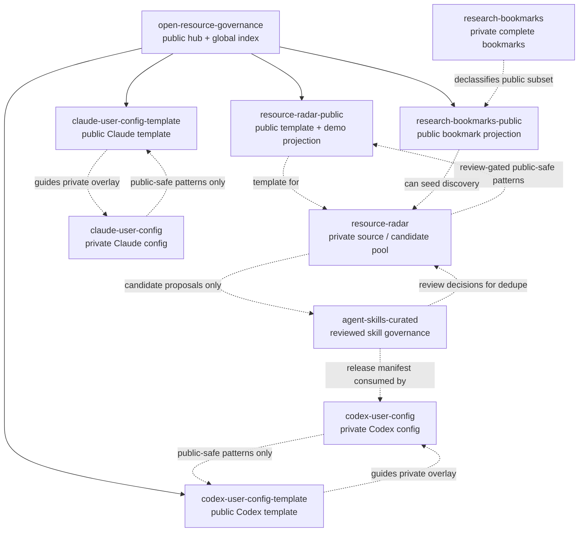

# Global System Topology

`open-resource-governance` is the public entry point and global index for the
resource-governance ecosystem. It should make the relationships visible without
turning every lane into one monolithic repository.

The machine-readable graph lives in [`data/topology.json`](../data/topology.json).

This is a graph, not a simple upstream/downstream chain. Some repositories
publish public-safe projections, some hold private state, some consume
candidates, and some can feed back review decisions so future discovery becomes
less noisy.

## Core distinction

```text
private source / overlay
  owns real private state, candidate pools, personal preferences, review notes

public template / projection
  owns reusable public-safe schema, docs, examples, generated outputs, validation
```

## Neutrality rule

User-configuration lanes may be agent-specific because they represent real
private environments:

- `codex-user-config` / `codex-user-config-template`
- `claude-user-config` / `claude-user-config-template`

All other lanes should remain agent-neutral, tool-neutral, reusable, and
portable. Resource discovery, bookmarks, curated skills, public templates,
validation policies, topology, and launch governance should not be framed as
Codex-only or Claude-only.

`agent-skills-curated` is downstream only for executable Skill artifacts. It is
not the destination for every useful resource. A resource may be a bookmark
seed, reference, dataset, tool, learning source, workflow, standard, or skill
candidate; only reviewed skill candidates should enter the curated Skills lane.

## Current graph



## What edges mean

Edges in the graph are governance relationships, not automatic write access.

- `indexes`: the hub documents and points to a repository.
- `public-template-for-private-source`: a public repo shows reusable structure
  that private automation can adopt.
- `declassifies-public-safe-subset-to`: a private repo can publish a reviewed
  public subset.
- `can-seed-public-resource-discovery`: one public-safe projection can become
  input evidence for discovery.
- `can-propose-reviewed-candidates-to`: a discovery lane can propose candidates
  but cannot bypass downstream admission.
- `may-expose-reviewed-decisions-for-deduplication`: a reviewed downstream lane
  can publish safe decision metadata so discovery does not keep resurfacing
  already accepted or rejected candidates.
- `may-contribute-public-safe-patterns-to`: private practice can improve a
  public template only after review and declassification.

## Why the hub needs a graph

Without a graph, users see many repositories and cannot tell:

- which repository is public or private;
- which repository owns source truth versus public projection;
- which repository is a template versus a real private environment;
- whether an edge allows reading, proposing, installing, or writing;
- which parts are agent-specific and which are neutral.

The hub graph makes those boundaries explicit. It is not release authority for
the other repositories; each lane still owns its own validation and release
rules.

## Current public runnable projections

- `research-bookmarks-public`: public-safe bookmark taxonomy, public source
  records, projection report, and generated browser-importable HTML.
- `resource-radar-public`: public-safe radar schema, universal domain taxonomy,
  demo resources, scoring/lifecycle examples, generated reports, and validation.

These public projections are meant to be reusable even when the private source
repositories are not visible.

## Candidate future lanes

Future terminal lanes are tracked separately from the current repository graph.
They are not implemented topology nodes until they pass a graduation rule.

See [`docs/future-lane-incubation.md`](future-lane-incubation.md) and
[`data/future-lanes.json`](../data/future-lanes.json).

This keeps the public map honest: the hub can acknowledge directions such as
project standards, knowledge graph projections, benchmark/evaluation,
documentation systems, architecture playbooks, domain resource packs, private
project absorption queues, and community-curated catalogs without pretending
they are already built.
